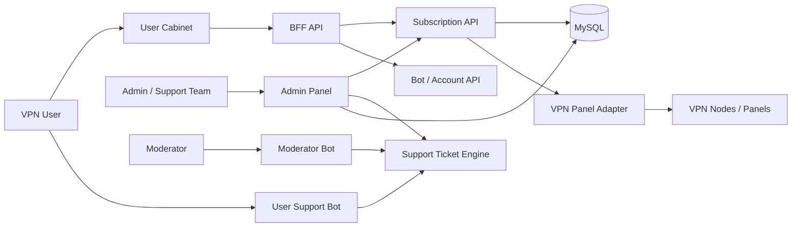

# VPN SaaS Architecture

System-level architecture case study of a VPN SaaS platform built end-to-end by a founder/lead engineer, covering architecture decisions, failure scenarios, and production risks.

This repository shows the system as a whole. The individual service repositories demonstrate implementation details, but this overview explains the architecture, trade-offs, operational risks, and my role as founder, lead engineer, and hands-on builder.

## 30-Second Overview

NKVPN is a VPN product where users need a simple experience: buy access, open the cabinet, connect devices, and get support when something breaks.

Behind that simple UX is a distributed system that must handle unreliable external providers, multi-device access policies, real-time support workflows, and operational mistakes that can affect paying users.

The system is composed of:

- user-facing cabinet;
- admin panel for operations;
- BFF API for frontend contracts;
- subscription API for access policies and provider sync;
- Telegram support bots;
- VPN panel/provider adapters.

## Impact

- Built the NKVPN platform from idea into a working product as founder and lead engineer.
- Created a multi-service VPN SaaS architecture covering user flows, admin operations, provider sync, and support.
- Enabled multi-device subscription management with explicit access policies.
- Reduced support friction through Telegram-first workflows connected to the same ticket engine as the admin panel.
- Added operational safety around privileged actions with RBAC, auditability, and provider isolation.
- Designed the system around unreliable VPN provider APIs and lack of transactional guarantees.
- Introduced repair and reconciliation mechanisms to handle inevitable state drift.
- Built a system that can tolerate unreliable external providers without breaking user access as the default outcome.
- Designed operational workflows where admin mistakes or partial failures do not immediately impact paying users.

## System Constraints

This system was built under real-world constraints:

- no control over VPN provider reliability;
- no distributed transactions across provider boundaries;
- need to support real users with minimal support friction;
- requirement to keep admin operations safe and auditable;
- limited tolerance for subscription/access inconsistencies from a user perspective.

These constraints shaped most architectural decisions.

## Reality of the System

This system was designed and built as a real product, not as a theoretical architecture.

It had to handle:

- real users connecting from multiple devices;
- support requests coming through Telegram in real time;
- inconsistent behavior from VPN providers;
- admin workflows where mistakes could affect paying users;
- subscription state that could drift from external provider panels.

This influenced multiple decisions:

- avoiding tight coupling with provider APIs;
- prioritizing safe retries and repair jobs over fake strict consistency;
- building admin safety mechanisms early;
- keeping provider credentials and privileged operations away from the browser;
- making support workflows visible across Telegram bots and the admin panel.

## My Role

I built this system end-to-end as the founder and lead engineer.

I was solely responsible for turning the product from idea into a working system: architecture, code, service boundaries, integrations, operational flows, and public-safe engineering documentation.

My responsibilities included:

- designing the overall architecture and service decomposition;
- implementing the core backend services and frontend applications;
- integrating external VPN providers and handling unreliable APIs;
- designing and building subscription lifecycle and policy logic;
- implementing support workflows across admin panel and Telegram bots;
- choosing the stack, repository structure, and integration approach;
- owning production-like risks around provider failures, support load, and unsafe admin operations.

I was accountable for system behavior as a whole, not just individual services.

## System Diagram

## Services

| Service | Responsibility | Public Repo |
|---|---|---|
| Admin Panel | Operations, users, subscriptions, support, RBAC | [nkvpn-admin-panel-showcase](https://github.com/MihichN/nkvpn-admin-panel-showcase) |
| User Cabinet | Subscription status, traffic, devices, account UI | [nkvpn-user-cabinet-showcase](https://github.com/MihichN/nkvpn-user-cabinet-showcase) |
| BFF API | Frontend-facing API facade and downstream coordination | [nkvpn-bff-api-showcase](https://github.com/MihichN/nkvpn-bff-api-showcase) |
| Subscription API | Device policies, traffic limits, provider sync | [nkvpn-subscription-api-showcase](https://github.com/MihichN/nkvpn-subscription-api-showcase) |
| Moderator Bot | Telegram workflow for support moderators | [nkvpn-moderator-bot-showcase](https://github.com/MihichN/nkvpn-moderator-bot-showcase) |
| User Support Bot | FAQ and ticket creation for users | [nkvpn-user-support-bot-showcase](https://github.com/MihichN/nkvpn-user-support-bot-showcase) |
| System Showcase | High-level platform summary | [vpn-saas-platform-showcase](https://github.com/MihichN/vpn-saas-platform-showcase) |

## Why This Architecture

### Why BFF?

The user cabinet should not know about internal bot APIs, subscription APIs, provider details, or support internals. The BFF owns frontend-facing contracts and normalizes downstream failures.

### Why separate subscription API?

Subscription provisioning has its own domain rules: device limits, traffic usage, expiration, provider sync, cleanup, and repair jobs. Keeping it separate makes policies testable and provider adapters replaceable.

### Why separate admin panel?

Admin workflows are privileged and operationally risky. They require RBAC, audit logs, confirmation flows, and server-side permission checks.

### Why Telegram bots?

For VPN users, support often starts in Telegram. Bots reduce friction and let moderators process tickets without living only in the web admin UI.

## Key Engineering Problems

### Subscription Consistency

Problem: local subscription state and provider panel state can drift.

Solution: local policy layer + provider adapters + background repair/cleanup jobs.

### Device Limits

Problem: users can connect from multiple devices, and limits must be enforced consistently.

Solution: deterministic policy checks before provider mutations.

### Provider Failures

Problem: external VPN panels can be slow, unavailable, or inconsistent.

Solution: isolate provider logic behind adapters, retry carefully, and surface sync errors to admin tools.

### Support Workflow

Problem: support context must be shared between web admin and Telegram bots.

Solution: shared ticket engine consumed by admin UI, moderator bot, and user bot.

### Admin Safety

Problem: admin actions can affect real users and infrastructure.

Solution: server-side RBAC, audit logs, confirmation flows, and no provider credentials in the browser.

## Failure Scenarios I Designed For

- VPN provider API timeout during subscription activation.
- Partial success where local state is updated but provider provisioning fails.
- Duplicate subscription/device mutation requests.
- Traffic sync delay causing incorrect user-facing limits.
- Telegram bot and admin panel desynchronization in support tickets.
- Provider panel returning inconsistent or stale state.
- Unsafe admin action affecting real subscriptions.

Each scenario required explicit handling to avoid user-facing inconsistencies, support overload, or broken access for active users.

## Example Failure Case

A typical failure scenario:

- user purchases or activates a subscription;
- local subscription state is updated successfully;
- VPN provider API times out during provisioning;
- user expects access but provider state is not updated yet;
- support receives a request while the system is in a partial-success state.

Handling this required:

- idempotent mutation design;
- background reconciliation jobs;
- admin visibility into partial failures;
- provider adapter isolation;
- support tooling to resolve user issues quickly.

Outcome:

- user impact is minimized;
- system recovers without manual intervention in most cases;
- support has enough context to resolve edge cases quickly.

## Deep Dive: Subscription Consistency

One of the hardest problems was keeping local subscription state consistent with external VPN providers.

Challenges:

- provider APIs can be unreliable or slow;
- external panels do not give transactional guarantees;
- local subscription state can drift from provider state;
- repair jobs must not accidentally disable valid access;
- support/admin tools need to understand what happened.

Solution:

- local policy layer acts as the source of truth for access decisions;
- provider logic is isolated behind adapters;
- mutations are designed to be safe to retry where possible;
- background repair/cleanup jobs reconcile provider state;
- admin tooling surfaces operational state instead of hiding failures.

Trade-off:

- the system accepts eventual consistency with explicit repair mechanisms instead of pretending strict distributed transactions exist.

Result:

- provider instability can be handled without coupling user-facing product logic directly to panel behavior.

## Trade-Offs

| Decision | Benefit | Cost |
|---|---|---|
| BFF layer | Stable frontend contracts | Extra service to maintain |
| Separate subscription API | Clear policy ownership | More integration boundaries |
| Provider adapters | Replaceable infrastructure | Adapter contracts must be tested |
| Telegram support bots | Faster support UX | More operational surfaces |
| Admin RBAC and audit logs | Safer operations | More upfront engineering |

## Production Risks

Key risks in this system:

- provider outages affecting active users;
- delayed traffic sync leading to incorrect limits;
- unsafe admin actions impacting real subscriptions;
- support overload during infrastructure incidents;
- internal API keys or provider credentials leaking across service boundaries.

Mitigation included:

- provider adapter isolation;
- retry and repair jobs;
- server-side RBAC;
- audit logs for privileged actions;
- shared support engine across web and Telegram channels;
- monitoring for provider latency and failed provisioning.

## Approximate Scale Targets

Public-safe operating assumptions:

- user cabinet read endpoints should be low-latency and cache-friendly;
- subscription mutations should be idempotent where possible;
- provider sync should move to background jobs as node count grows;
- admin dashboards should rely on precomputed/read-optimized views when traffic grows.

Exact production metrics are not published for confidentiality reasons.

## Public vs Private

Public repositories include:

- architecture diagrams;
- sanitized examples;
- API contracts;
- ADRs;
- tests and CI for key service showcases;
- production considerations.

Private production repositories include:

- VPN provider credentials;
- server inventory;
- real subscription links;
- user data;
- billing details;
- deployment configuration.

## Recommended Reading Order

1. [Subscription API](https://github.com/MihichN/nkvpn-subscription-api-showcase) - policies, provider boundary, OpenAPI.
2. [BFF API](https://github.com/MihichN/nkvpn-bff-api-showcase) - frontend contracts and downstream resilience.
3. [Admin Panel](https://github.com/MihichN/nkvpn-admin-panel-showcase) - RBAC, auditability, operations.
4. [User Cabinet](https://github.com/MihichN/nkvpn-user-cabinet-showcase) - user-facing product surface.
