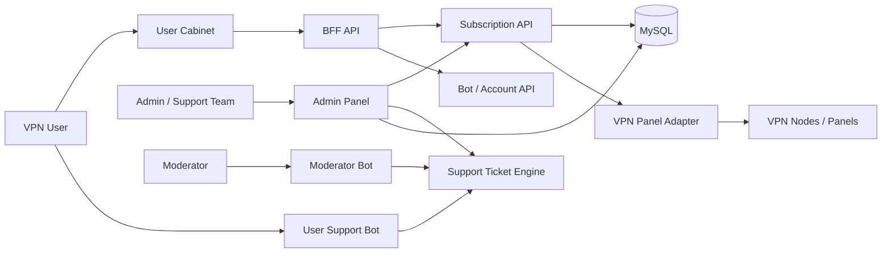

# VPN SaaS Architecture

System-level architecture case study for NKVPN: a VPN SaaS platform with a user cabinet, admin panel, BFF API, subscription API, Telegram support bots, and VPN provider integration boundaries.

This repository shows the system as a whole. The individual service repositories demonstrate implementation details, but this overview explains the architecture, trade-offs, operational risks, and my role as founder/architect.

## 30-Second Overview

NKVPN is a VPN product where users need a simple experience: buy access, open the cabinet, connect devices, and get support when something breaks.

Behind that simple UX is a distributed product system:

- user-facing cabinet;
- admin panel for operations;
- BFF API for frontend contracts;
- subscription API for access policies and provider sync;
- Telegram support bots;
- VPN panel/provider adapters.

## My Role

I am the founder of NKVPN and designed the platform architecture end-to-end.

My responsibilities included:

- defining service boundaries between cabinet, admin, BFF, subscription API, and bots;
- designing the subscription lifecycle and access policies;
- choosing the stack and integration approach;
- implementing key frontend/backend parts;
- designing support workflows across web admin and Telegram bots;
- creating public-safe documentation and showcase repositories.

## System Diagram

## Services

| Service | Responsibility | Public Repo |
|---|---|---|
| Admin Panel | Operations, users, subscriptions, support, RBAC | [nkvpn-admin-panel-showcase](https://github.com/MihichN/nkvpn-admin-panel-showcase) |
| User Cabinet | Subscription status, traffic, devices, account UI | [nkvpn-user-cabinet-showcase](https://github.com/MihichN/nkvpn-user-cabinet-showcase) |
| BFF API | Frontend-facing API facade and downstream coordination | [nkvpn-bff-api-showcase](https://github.com/MihichN/nkvpn-bff-api-showcase) |
| Subscription API | Device policies, traffic limits, provider sync | [nkvpn-subscription-api-showcase](https://github.com/MihichN/nkvpn-subscription-api-showcase) |
| Moderator Bot | Telegram workflow for support moderators | [nkvpn-moderator-bot-showcase](https://github.com/MihichN/nkvpn-moderator-bot-showcase) |
| User Support Bot | FAQ and ticket creation for users | [nkvpn-user-support-bot-showcase](https://github.com/MihichN/nkvpn-user-support-bot-showcase) |
| System Showcase | High-level platform summary | [vpn-saas-platform-showcase](https://github.com/MihichN/vpn-saas-platform-showcase) |

## Why This Architecture

### Why BFF?

The user cabinet should not know about internal bot APIs, subscription APIs, provider details, or support internals. The BFF owns frontend-facing contracts and normalizes downstream failures.

### Why separate subscription API?

Subscription provisioning has its own domain rules: device limits, traffic usage, expiration, provider sync, cleanup, and repair jobs. Keeping it separate makes policies testable and provider adapters replaceable.

### Why separate admin panel?

Admin workflows are privileged and operationally risky. They require RBAC, audit logs, confirmation flows, and server-side permission checks.

### Why Telegram bots?

For VPN users, support often starts in Telegram. Bots reduce friction and let moderators process tickets without living only in the web admin UI.

## Key Engineering Problems

### Subscription Consistency

Problem: local subscription state and provider panel state can drift.

Solution: local policy layer + provider adapters + background repair/cleanup jobs.

### Device Limits

Problem: users can connect from multiple devices, and limits must be enforced consistently.

Solution: deterministic policy checks before provider mutations.

### Provider Failures

Problem: external VPN panels can be slow, unavailable, or inconsistent.

Solution: isolate provider logic behind adapters, retry carefully, and surface sync errors to admin tools.

### Support Workflow

Problem: support context must be shared between web admin and Telegram bots.

Solution: shared ticket engine consumed by admin UI, moderator bot, and user bot.

### Admin Safety

Problem: admin actions can affect real users and infrastructure.

Solution: server-side RBAC, audit logs, confirmation flows, and no provider credentials in the browser.

## Trade-Offs

| Decision | Benefit | Cost |
|---|---|---|
| BFF layer | Stable frontend contracts | Extra service to maintain |
| Separate subscription API | Clear policy ownership | More integration boundaries |
| Provider adapters | Replaceable infrastructure | Adapter contracts must be tested |
| Telegram support bots | Faster support UX | More operational surfaces |
| Admin RBAC and audit logs | Safer operations | More upfront engineering |

## Production Concerns

- Internal API key management.
- Provider credentials and panel cookies.
- Traffic sync lag.
- Repair jobs that are safe to re-run.
- Audit logs for admin actions.
- Support ticket SLA and routing.
- Monitoring for provider latency and failed provisioning.
- Incident playbooks for VPN node outages.

## Approximate Scale Targets

Public-safe operating assumptions:

- user cabinet read endpoints should be low-latency and cache-friendly;
- subscription mutations should be idempotent where possible;
- provider sync should move to background jobs as node count grows;
- admin dashboards should rely on precomputed/read-optimized views when traffic grows.

Exact production metrics are not published for confidentiality reasons.

## Public vs Private

Public repositories include:

- architecture diagrams;
- sanitized examples;
- API contracts;
- ADRs;
- tests and CI for key service showcases;
- production considerations.

Private production repositories include:

- VPN provider credentials;
- server inventory;
- real subscription links;
- user data;
- billing details;
- deployment configuration.

## Recommended Reading Order

1. [Subscription API](https://github.com/MihichN/nkvpn-subscription-api-showcase) - policies, provider boundary, OpenAPI.
2. [BFF API](https://github.com/MihichN/nkvpn-bff-api-showcase) - frontend contracts and downstream resilience.
3. [Admin Panel](https://github.com/MihichN/nkvpn-admin-panel-showcase) - RBAC, auditability, operations.
4. [User Cabinet](https://github.com/MihichN/nkvpn-user-cabinet-showcase) - user-facing product surface.
